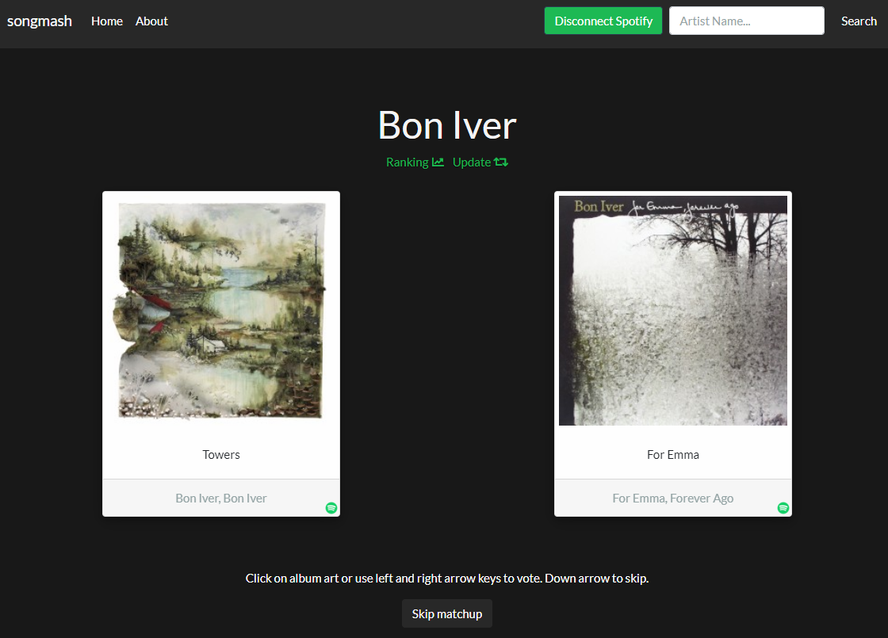
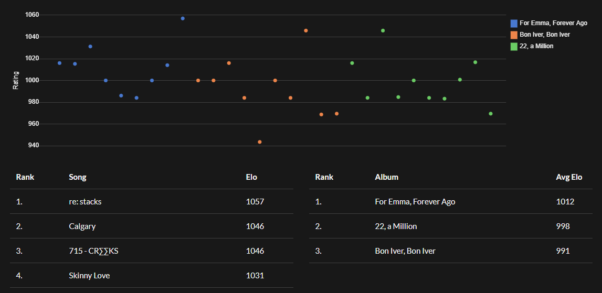

# songmash
:cd: Crowdsourced rankings of artist discographies

Uses Elo rating to rank songs from an artist's discography based on user voting between two randomly selected songs.




## Configuration

For Spotify integration to work, a `spotify.cfg` file is needed, defining the following variables:

```
CLIENT_ID
CLIENT_SECRET
REDIRECT_URI
```
which can be obtained from the [Spotify Developer website](https://developer.spotify.com/) by registering an application.

Please **DO NOT** use the `SECRET_KEY` present in `songmash.py`, it is for **DEMONSTRATION PURPOSES ONLY**